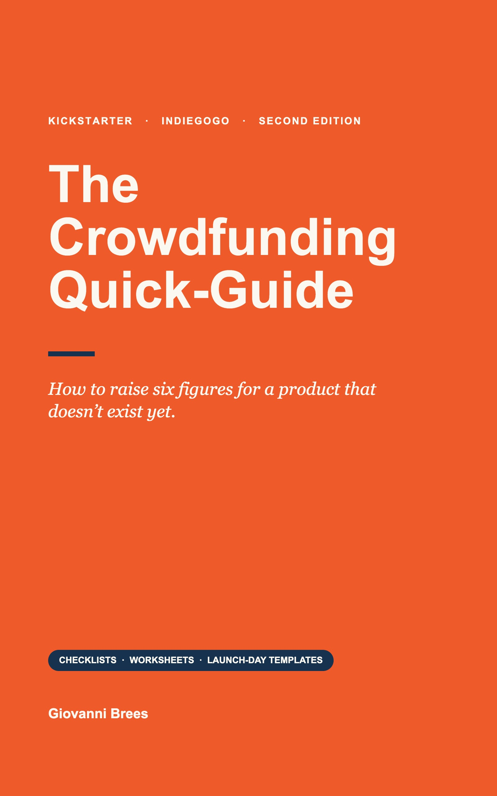

# The Crowdfunding Quick-Guide

### How to raise six figures for a product that doesn't exist yet.

**By [Giovanni Brees](https://www.giovannibrees.com) · 2nd Edition · Crowdfunding & Entrepreneurship**

[**🌐 Official website**](https://www.giovannibreesbook.com) &nbsp;·&nbsp; [**📖 Get it on Amazon**](https://www.amazon.com/dp/B0GY64VXN4) &nbsp;·&nbsp; [**💼 LinkedIn**](https://www.linkedin.com/in/giovannibrees/)

*As featured in* **Forbes · The New York Times · Bloomberg**

---

## About the book

You build the crowd **before** you build the product — and this book shows you exactly how. Crowdfunding isn't luck. It's a **system**.

Most first-time creators learn the hard way, after a campaign stalls. *The Crowdfunding Quick-Guide* hands you the playbook up front: the three phases of a campaign, the four sources nearly all the money comes from, and exactly what to do at each step — refined across nearly two decades and more than **$500 million raised** on Kickstarter and Indiegogo.

### Where the money comes from

Nearly every funded campaign is powered by the same four sources, covered in Chapters 2–4:

1. **Pre-launch email list**
2. **Paid advertising**
3. **PR & media placement**
4. **The platform crowd**

## Inside the book — seven chapters, launch-ready

| # | Chapter | What you'll learn |
| :-: | --- | --- |
| 01 | **Finding Your USPs & Target Audience** | Pin down what makes you different and exactly who you're for |
| 02 | **Testing Your Audience & Offer** | Validate demand before you spend a dollar on production |
| 03 | **Marketing & Ad Spend** | Build a pre-launch list and turn ad spend into backers |
| 04 | **The Best Platform For YOU** | Choose between Kickstarter, Indiegogo and the rest |
| 05 | **Campaign Planning & Costs** | Pricing, budgeting and funding-goal math that adds up |
| 06 | **Campaign Go-Live (Launch)** | A launch-day plan, swipe emails and a press pitch |
| 07 | **Options After Your Launch** | Fulfilment, late pledges and turning backers into a business |

### From the back cover

No fluff. Just the steps — with the worksheets to implement them.

- ✅ Pre-launch audience building that funds you on day one
- ✅ The $5–$10 reservation deposit that creates buyers early
- ✅ Reward tiers, pricing & funding-goal math that adds up
- ✅ A 90-day launch timeline, swipe emails & a press pitch

> ★★★★★ *"A must-read for everyone thinking of running a crowdfunding campaign!"* — AJ Welsh

## About the author

**Giovanni Brees** is a serial entrepreneur, founder and author based in New York. From 2010 to 2025 he built and ran a group of marketing companies — including a product-launch operation that took more than **4,500 products** to market and helped raise **over half a billion dollars** on Kickstarter and Indiegogo.

He is the founder behind **Meet Oscar**, **CiteEngine** and **KentoHQ**, and the author of *The Zero-Employee Company* (2026) and *The Crowdfunding Quick-Guide*. Today he runs a portfolio of ventures operated by AI agents he designs, governs and inspects rather than manages.

**Book details:** ISBN 979-8-9867165-0-3 · 50 pages · English · Publisher: BoostYourCampaign

---

## About this repository

This repo hosts the production website served at [www.giovannibreesbook.com](https://www.giovannibreesbook.com) via GitHub Pages. `index.html` is fully self-contained (styles, fonts and imagery inlined) — no build step, no framework, no dependencies.

| File | Purpose |
| --- | --- |
| `index.html` | The complete site (self-contained; do not minify or reformat) |
| `book-cover.jpg`, `book-back.jpg` | Book imagery, fetched by social crawlers (`og:image`) |
| `giovanni-brees.png` | Author portrait, referenced by structured data (JSON-LD) |
| `favicon-32.png`, `favicon.png`, `apple-touch-icon.png` | Favicons |
| `robots.txt`, `sitemap.xml` | SEO files |
| `CNAME` | Custom domain for GitHub Pages |

All assets intentionally live at the repository root — external crawlers fetch them by absolute URL (e.g. `/book-cover.jpg`), so they must not be moved into subfolders. Pushing to `gh-pages` publishes the site; keep `main` in sync.

---

© Giovanni Brees. All rights reserved.

