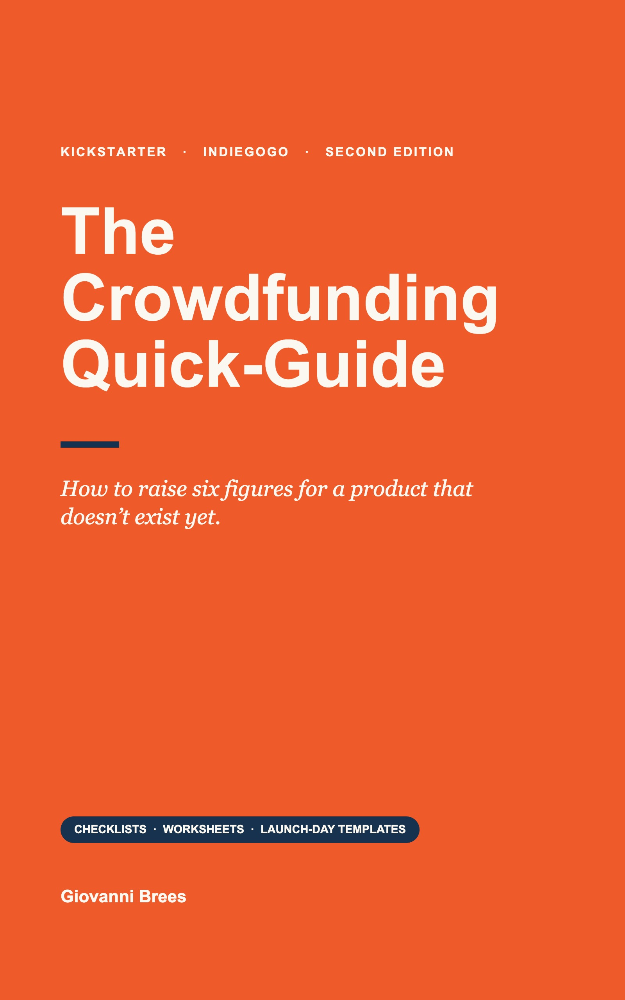

# The Crowdfunding Quick-Guide

### How to raise six figures for a product that doesn't exist yet.

**By [Giovanni Brees](https://www.giovannibrees.com) · 2nd Edition · Crowdfunding & Entrepreneurship**

[**🌐 Book website**](https://www.giovannibreesbook.com) &nbsp;·&nbsp; [**📖 Get it on Amazon**](https://www.amazon.com/dp/B0GY64VXN4) &nbsp;·&nbsp; [**💼 LinkedIn**](https://www.linkedin.com/in/giovannibrees/)

*As featured in* **Forbes · The New York Times · Bloomberg**

---

## About the book

You build the crowd **before** you build the product — and this book shows you exactly how. Crowdfunding isn't luck. It's a **system**.

Most first-time creators learn the hard way, after a campaign stalls. *The Crowdfunding Quick-Guide* hands you the playbook up front: the three phases of a campaign, the four sources nearly all the money comes from, and exactly what to do at each step — refined across fifteen years and more than **$700 million raised** on Kickstarter and Indiegogo.

### Where the money comes from

Nearly every funded campaign is powered by the same four sources, covered in Chapters 2–4:

1. **Pre-launch email list**
2. **Paid advertising**
3. **PR & media placement**
4. **The platform crowd**

## Inside the book — full table of contents

*31 chapters, in the order of a real campaign.*

- *Introduction*
- *How to Use This Book*
- *Crowdfunding Demystified & the 3 Phases*
- *Getting Started: From Idea to Prototype*
- *Getting Started: Do It Yourself or Hire Help?*

1. **Finding Your USPs & Target Audience**
2. **Testing Your Audience & Offer**
3. **Landing Pages, Email & Community**
4. **Paid Ads, Creative, PR & Influencers**
5. **Choosing Your Platform**
6. **Rewards, Pricing & Pledge Tiers**
7. **Budgeting & Setting Your Funding Goal**
8. **Your Campaign Page & Video**
9. **Go-Live: The First 48 Hours & the Full Run**
10. **Manufacturing, Fulfillment & Pledge Management**
11. **Life After the Campaign**
12. **Launching a Game: the Complete Playbook**
13. **From Campaign to eCommerce**
14. **PR & Press: the Full Playbook**
15. **Going Global**
16. **The Go-to-Market Deep Dive**
17. **The Crisis Playbook**
18. **The AI Toolkit (2026)**
19. **Equity & Alternative Funding**
20. **Campaign Two**
21. **Product Photography & Visual Assets**
22. **The Campaign Video, Shot by Shot**
23. **Meta Ads: The Complete Deep Dive**
24. **Manufacturing & Sourcing**
25. **Fulfillment & Logistics**
26. **Building Community**
27. **Influencer & Creator Partnerships**
28. **Financial Management**
29. **Real Campaign Teardowns**
30. **Founder Mindset & Resilience**
31. **Sustainability & Ethical Manufacturing**

- *Why Campaigns Fail, and How to Be the 37%*
- *Appendices A to G*
- *About the Author*

### From the back cover

No fluff. Just the steps — with the worksheets to implement them.

- ✅ Pre-launch audience building that funds you on day one
- ✅ The $5–$10 reservation deposit that creates buyers early
- ✅ Reward tiers, pricing & funding-goal math that adds up
- ✅ A 90-day launch timeline, swipe emails & a press pitch

> ★★★★★ *"A must-read for everyone thinking of running a crowdfunding campaign!"* — AJ Welsh

## About the author

**Giovanni Brees** is a serial entrepreneur, founder and author. From 2010 to 2025 he built and ran a group of marketing companies — including a product-launch operation that took more than **4,500 products** to market and helped raise **over half a billion dollars** on Kickstarter and Indiegogo.

He is the founder behind **Meet Oscar**, **CiteEngine** and **KentoHQ**, and the author of *The Zero-Employee Company* (2026) and *The Crowdfunding Quick-Guide*. He is also an investor, backing companies through MaxCapital since 2007, while his newest companies run on AI agents he designs and governs.

**Book details:** ISBN 979-8-9867165-0-3 · 400+ pages (print edition) · English · Publisher: BoostYourCampaign

---

## About this repository

This repo hosts the production website served at [www.giovannibreesbook.com](https://www.giovannibreesbook.com) via GitHub Pages. `index.html` is fully self-contained (styles, fonts and imagery inlined) — no build step, no framework, no dependencies.

| File | Purpose |
| --- | --- |
| `index.html` | The complete site (self-contained; do not minify or reformat) |
| `book-cover.jpg`, `book-back.jpg` | Book imagery, fetched by social crawlers (`og:image`) |
| `giovanni-brees.png` | Author portrait, referenced by structured data (JSON-LD) |
| `favicon-32.png`, `favicon.png`, `apple-touch-icon.png` | Favicons |
| `robots.txt`, `sitemap.xml` | SEO files |
| `CNAME` | Custom domain for GitHub Pages |

All assets intentionally live at the repository root — external crawlers fetch them by absolute URL (e.g. `/book-cover.jpg`), so they must not be moved into subfolders. Pushing to `gh-pages` publishes the site; keep `main` in sync.

---

© Giovanni Brees. All rights reserved.

